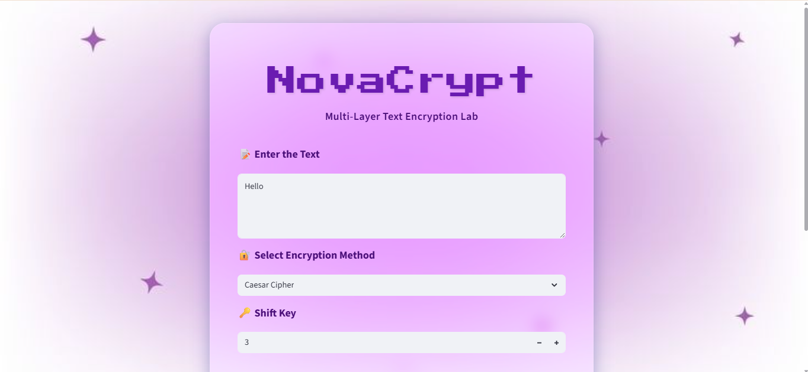
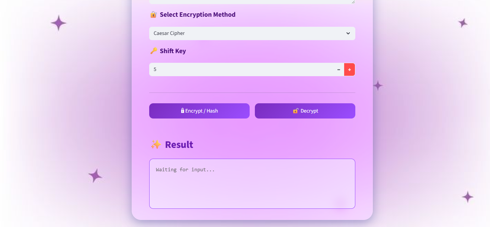
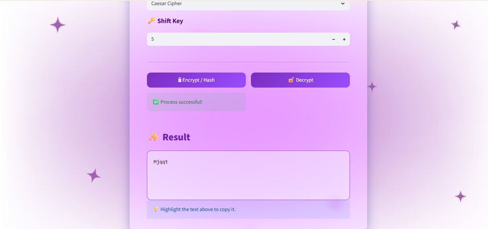

# 🔐NovaCrypt — Multi-Layer Encryption Toolkit  
**A modular Python toolkit demonstrating layered classical encryption, hashing, and interactive cryptography workflows through Web and CLI interfaces.**

<p align="center">
  
  
  
  
</p>

<p align="center">
🔐An interactive cryptography learning toolkit built with Python & Streamlit🔐
</p>

---

## 🌟About the Project  

**NovaCrypt** is a modular cryptography learning toolkit that implements multiple classical encryption algorithms along with a custom **multi-layer encryption pipeline**. It provides both a Streamlit web interface and a command-line tool, allowing users to experiment with encryption, decryption, and hashing in an interactive way.

> ⚠️Note:  
> The cryptographic techniques implemented are **educational** and are **not intended for real-world secure communication**.

---

## 🚀Features  

✤ **Caesar Cipher** – Shift-based substitution encryption  
✤ **Vigenère Cipher** – Keyword-based polyalphabetic encryption  
✤ **Reverse Transformation** – Structural obfuscation layer<br>
✤ **ASCII Shift Cipher** – Safe shifting within printable ASCII range  
✤ **Base64 Encoding / Decoding** – Encoding for data representation  
✤ **SHA-256 Hashing** – One-way cryptographic hashing  
✤ **Multi-Layer Encryption Mode** – Sequential cipher chaining  
✤ **Dual Interface Support** – Web App (Streamlit) + CLI Tool  
✤ **Verbose Encryption Flow** – Step-by-step transformation visibility  

---

## 🎯Why This Project Matters

**NovaCrypt** is not just an encryption demo, it demonstrates:

✤ Practical implementation of classical cryptographic algorithms  
✤ Design of reversible transformation pipelines  
✤ Modular software architecture with separation of concerns  
✤ Integration of backend logic with both CLI and Web interfaces  
✤ Understanding of hashing vs encryption concepts  

This project highlights both **cryptography fundamentals** and **real-world software design practices**.

---

## 🛠Tech Stack  

| Category | Technology |
|--------|------------|
| 💻Language | Python |
| 🌐Web Framework | Streamlit |
| 🖥CLI | Python Standard I/O |
| 🔐Cryptography | Classical Ciphers + SHA-256 |
| 🎨UI Styling | Custom CSS (Glassmorphism) |
| 🧱Architecture | Modular, Layered Design |

---

## 🧠Project Architecture  

NovaCrypt follows a **layered and modular architecture**, ensuring separation of concerns and easy extensibility:

**User Interface Layer** <br>
(Streamlit Web App / CLI) <br>
↓<br>
**Encryption Controller** <br>
(Multi-Layer Pipeline) <br>
↓<br>
**Cipher Logic Layer** <br>
(Caesar, Vigenère, ASCII Shift, Base64, SHA-256) <br>

**Key Design Principles** : <br>
✤ Separation of concerns  
✤ Reusable cipher modules  
✤ Easily extendable architecture  
✤ Independent UI and encryption layers 

---

## 🔐Multi-Layer Encryption Pipeline  

NovaCrypt supports a **custom multi-layer encryption mode** that chains multiple classical ciphers sequentially.

### 🔒Encryption Order  
1. Caesar Cipher  
2. Vigenère Cipher  
3. Reverse Text Transformation  
4. ASCII Shift (Printable Characters Only)  
5. Base64 Encoding  

### 🔓Decryption Order (Reverse)  
1. Base64 Decoding  
2. ASCII Unshift  
3. Reverse Text  
4. Vigenère Decryption  
5. Caesar Decryption  

This approach demonstrates how reversible transformations can be combined to enhance **data obfuscation** while maintaining recoverability.

### ⚠️Security Disclaimer

**NovaCrypt** is built for **educational and demonstration purposes only**.  
The classical ciphers included (Caesar, Vigenère, ASCII Shift, etc.) are **not secure for modern cryptographic use**.

This project focuses on **understanding encryption mechanics, transformation chaining, and software design**, not real-world secure communication.

---
## 🖥Web App Preview  
📌Screenshots captured from the NovaCrypt Streamlit Web Application  
### 🏠Main Interface  
<p align="center">
  
</p>

---

### 🔐Encryption Panel  
<p align="center">
  
</p>

---

### ✨Result Display  
<p align="center">
  
</p>

---

## 🎥Live Demonstrations

**NovaCrypt** supports both a graphical web interface and a command-line interface.  
Below are short walkthrough demonstrations of each mode in action.

### 🌐Streamlit Web Application Demo

▶️Watch the Web App Demo:
https://github.com/user-attachments/assets/84aa8386-84b7-46bc-9305-55f93b0d844b


### 💻CLI Interface Demo

▶️Watch the CLI Demo:
https://github.com/user-attachments/assets/0d514850-e667-4078-9dcf-c8373314e6da

---
## ⚙️System Requirements  

- **Python**: 3.9 or higher  
- **Streamlit**: Latest stable version  
- **Operating System**: Windows / Linux / macOS  

---

## ▶️How to Run the Project  

### 1️⃣Clone the Repository  
```bash
git clone https://github.com/<your-actual-username>/NovaCrypt.git
cd NovaCrypt
```
### 2️⃣Install Dependencies
```bash
pip install -r requirements.txt
```
### 3️⃣Run the Web Application
```bash
streamlit run app.py
```
### 4️⃣ Run the CLI Tool (Optional)
```bash 
python terminal_app.py
```

---
## 🔮Future Enhancements

✤ File-based encryption and decryption <br>
✤ Integration of modern cryptographic algorithms (AES) <br>
✤ Password-based key derivation (PBKDF2) <br>
✤ Deployment using Streamlit Cloud <br>
✤ Performance and security comparisons between ciphers <br>

---
## 👩‍💻Author
Nandini Saxena <br>
🎓B.Tech (Computer Science & Engineering) <br>
💡Interested in Cryptography, Secure Systems, and Software Architecture <br>

<p align="center">✨If you like this project, don’t forget to star the repository✨</p> 
